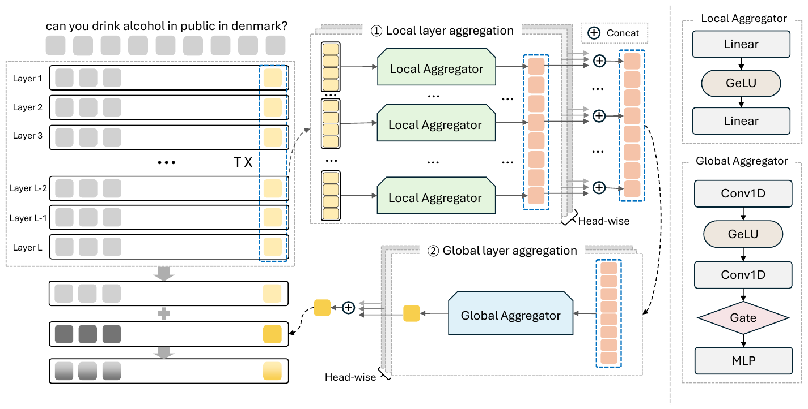

<div align="center">

# Capacity without Access: Reinterpreting the Mid-Depth Spectral Plateau in LLMs

**Seong-Min Kang** &nbsp;·&nbsp; **[Woo-Seong Yun](https://scholar.google.com/citations?user=ZRXyvtMAAAAJ)** &nbsp;·&nbsp; **Nahyun Lee** &nbsp;·&nbsp; **Yoon-Sik Cho**

<sub>Department of Artificial Intelligence, Chung-Ang University</sub>

*ICML 2026 (43rd International Conference on Machine Learning), PMLR 306, Seoul, South Korea*

[](https://openreview.net/forum?id=wsw7Y085RY)
[](https://pytorch.org/)

</div>

This is the PyTorch implementation for our ICML 2026 paper:

> Capacity without Access: Reinterpreting the Mid-Depth Spectral Plateau in LLMs (ICML, 2026)

This repository is a fork of the official implementation at [kang7734/Capacity-without-Access](https://github.com/kang7734/Capacity-without-Access).

<p align="center">
  
</p>

## Overview

Probing studies report that deeper LLM layers encode increasingly abstract semantics, while residual-dynamics studies find that deeper updates become near-identity. To resolve this apparent conflict, we separate *representational capacity*, the spectral diversity of encoded features, from *accessibility*, the extent to which those features project onto the output-relevant subspace. Second-moment analysis across depth shows that mid-depth layers keep a broad spectrum and stable effective rank yet couple only weakly to the unembedding subspace: capacity is intact, access is constrained. To test this, we introduce the **Depth-Aware Diagnostic Intervention (DDI)**, a training-time route that aggregates intermediate hidden states and exposes them to the terminal readout, then is removed so inference is unchanged. Across Llama-3, Qwen2, Mistral and Phi-3.5, DDI raises readout access without inflating capacity and yields selective gains on multi-step reasoning benchmarks.

## Requirements

```bash
pip install torch==2.1.2 transformers peft datasets fire
```

Model weights are loaded from the Hugging Face Hub. Commonsense and arithmetic reasoning data follow the format of [LLM-Adapters](https://github.com/AGI-Edgerunners/LLM-Adapters).

## Datasets

We evaluate on seven commonsense reasoning benchmarks (OBQA, ARC-e, ARC-c, WinoGrande, PIQA, BoolQ, HellaSwag) and five arithmetic reasoning benchmarks (SVAMP, AddSub, AQuA, MultiArith, GSM8K), using four backbones: Llama-3-8B, Qwen2-7B, Mistral-7B and Phi-3.5-Mini. All results are averaged over five seeds.

## Training

`finetune.py` fine-tunes a backbone with LoRA and the DDI auxiliary route. The route is discarded after training, so the finalized model is evaluated through the original inference path.

```bash
python finetune.py \
    --base_model meta-llama/Meta-Llama-3-8B \
    --data_path ./data/commonsense_170k.json \
    --output_dir ./outputs/llama3-ddi \
    --batch_size 16 --micro_batch_size 4 --num_epochs 3 --learning_rate 3e-4 \
    --lora_r 32 --lora_alpha 64
```

`llama_vert.py` contains the DDI modules (local and global aggregators and the diagnostic readout). Reference notebooks for the analysis figures, including effective rank, SVCCA, CKA and unembedding-subspace access ratio, are provided under `figures/`.

## Results

Accuracy (%) of the LoRA baseline and the finalized backbone trained with DDI (+ Ours), averaged over five seeds (Tables 2 and 3 of the paper).

<table>
  <thead>
    <tr>
      <th rowspan="2" align="left">Model</th>
      <th colspan="8" align="center">Commonsense reasoning</th>
    </tr>
    <tr>
      <th align="center">OBQA</th><th align="center">ARC-e</th><th align="center">ARC-c</th><th align="center">WinoG.</th><th align="center">PIQA</th><th align="center">BoolQ</th><th align="center">HellaS.</th><th align="center">Avg.</th>
    </tr>
  </thead>
  <tbody>
    <tr><td align="left">Llama3 + LoRA</td><td align="center">84.9</td><td align="center">90.2</td><td align="center">79.9</td><td align="center">85.5</td><td align="center">87.9</td><td align="center">69.9</td><td align="center">94.4</td><td align="center">84.7</td></tr>
    <tr><td align="left">&nbsp;&nbsp;+ Ours</td><td align="center"><b>85.3</b></td><td align="center"><b>90.3</b></td><td align="center"><b>80.5</b></td><td align="center">85.1</td><td align="center"><b>88.7</b></td><td align="center"><b>71.8</b></td><td align="center"><b>94.9</b></td><td align="center"><b>85.2</b></td></tr>
    <tr><td align="left">Qwen2 + LoRA</td><td align="center">89.3</td><td align="center">92.7</td><td align="center">83.1</td><td align="center">85.5</td><td align="center">89.5</td><td align="center">73.9</td><td align="center">94.6</td><td align="center">86.9</td></tr>
    <tr><td align="left">&nbsp;&nbsp;+ Ours</td><td align="center">89.1</td><td align="center"><b>93.2</b></td><td align="center"><b>84.2</b></td><td align="center"><b>85.7</b></td><td align="center"><b>89.8</b></td><td align="center"><b>74.1</b></td><td align="center"><b>94.8</b></td><td align="center"><b>87.3</b></td></tr>
    <tr><td align="left">Mistral + LoRA</td><td align="center">84.0</td><td align="center">85.7</td><td align="center">73.4</td><td align="center">83.0</td><td align="center">87.4</td><td align="center">71.0</td><td align="center">90.3</td><td align="center">82.1</td></tr>
    <tr><td align="left">&nbsp;&nbsp;+ Ours</td><td align="center"><b>85.4</b></td><td align="center"><b>86.1</b></td><td align="center"><b>74.6</b></td><td align="center"><b>84.5</b></td><td align="center"><b>87.5</b></td><td align="center"><b>71.8</b></td><td align="center"><b>90.7</b></td><td align="center"><b>82.9</b></td></tr>
    <tr><td align="left">Phi-3.5 + LoRA</td><td align="center">88.6</td><td align="center">94.4</td><td align="center">85.4</td><td align="center">83.0</td><td align="center">86.1</td><td align="center">70.3</td><td align="center">90.8</td><td align="center">85.5</td></tr>
    <tr><td align="left">&nbsp;&nbsp;+ Ours</td><td align="center"><b>89.3</b></td><td align="center"><b>94.7</b></td><td align="center"><b>86.0</b></td><td align="center"><b>83.6</b></td><td align="center"><b>86.8</b></td><td align="center"><b>70.5</b></td><td align="center">90.8</td><td align="center"><b>86.0</b></td></tr>
  </tbody>
</table>

<table>
  <thead>
    <tr>
      <th rowspan="2" align="left">Model</th>
      <th colspan="6" align="center">Arithmetic reasoning</th>
    </tr>
    <tr>
      <th align="center">SVAMP</th><th align="center">AddSub</th><th align="center">AQuA</th><th align="center">MultiArith</th><th align="center">GSM8K</th><th align="center">Avg.</th>
    </tr>
  </thead>
  <tbody>
    <tr><td align="left">Llama3 + LoRA</td><td align="center">82.7</td><td align="center">92.9</td><td align="center">32.3</td><td align="center">98.0</td><td align="center">72.9</td><td align="center">75.8</td></tr>
    <tr><td align="left">&nbsp;&nbsp;+ Ours</td><td align="center"><b>83.8</b></td><td align="center">92.9</td><td align="center"><b>34.3</b></td><td align="center"><b>98.3</b></td><td align="center"><b>73.6</b></td><td align="center"><b>76.6</b></td></tr>
    <tr><td align="left">Qwen2 + LoRA</td><td align="center">82.8</td><td align="center">91.6</td><td align="center">36.9</td><td align="center">97.3</td><td align="center">73.9</td><td align="center">76.5</td></tr>
    <tr><td align="left">&nbsp;&nbsp;+ Ours</td><td align="center"><b>83.5</b></td><td align="center">91.2</td><td align="center"><b>37.6</b></td><td align="center">97.3</td><td align="center"><b>75.0</b></td><td align="center"><b>76.9</b></td></tr>
    <tr><td align="left">Mistral + LoRA</td><td align="center">65.3</td><td align="center">87.9</td><td align="center">23.7</td><td align="center">95.0</td><td align="center">62.6</td><td align="center">66.9</td></tr>
    <tr><td align="left">&nbsp;&nbsp;+ Ours</td><td align="center"><b>66.8</b></td><td align="center"><b>88.9</b></td><td align="center"><b>24.7</b></td><td align="center"><b>95.3</b></td><td align="center"><b>63.2</b></td><td align="center"><b>67.8</b></td></tr>
    <tr><td align="left">Phi-3.5 + LoRA</td><td align="center">76.4</td><td align="center">86.1</td><td align="center">33.6</td><td align="center">98.1</td><td align="center">76.0</td><td align="center">74.0</td></tr>
    <tr><td align="left">&nbsp;&nbsp;+ Ours</td><td align="center"><b>76.9</b></td><td align="center">85.5</td><td align="center"><b>34.1</b></td><td align="center"><b>98.4</b></td><td align="center"><b>77.0</b></td><td align="center"><b>74.4</b></td></tr>
  </tbody>
</table>

## Citation

If you find this work useful, please cite:

```bibtex
@inproceedings{kang2026capacity,
  title     = {Capacity without Access: Reinterpreting the Mid-Depth Spectral Plateau in {LLM}s},
  author    = {Seong-Min Kang and Woo-Seong Yun and Nahyun Lee and Yoon-Sik Cho},
  booktitle = {Proceedings of the 43rd International Conference on Machine Learning},
  series    = {ICML '26},
  year      = {2026},
  publisher = {PMLR},
  url       = {https://openreview.net/forum?id=wsw7Y085RY}
}
```

## Acknowledgements

This work was supported by the Institute of Information & Communications Technology Planning & Evaluation (IITP) grant funded by the Korea government (MSIT) [RS-2021-II211341, Artificial Intelligence Graduate School Program (Chung-Ang University)] and under the Leading Generative AI Human Resources Development (IITP-2026-RS-2026-25544647).

Our implementation builds on [LLM-Adapters](https://github.com/AGI-Edgerunners/LLM-Adapters).
